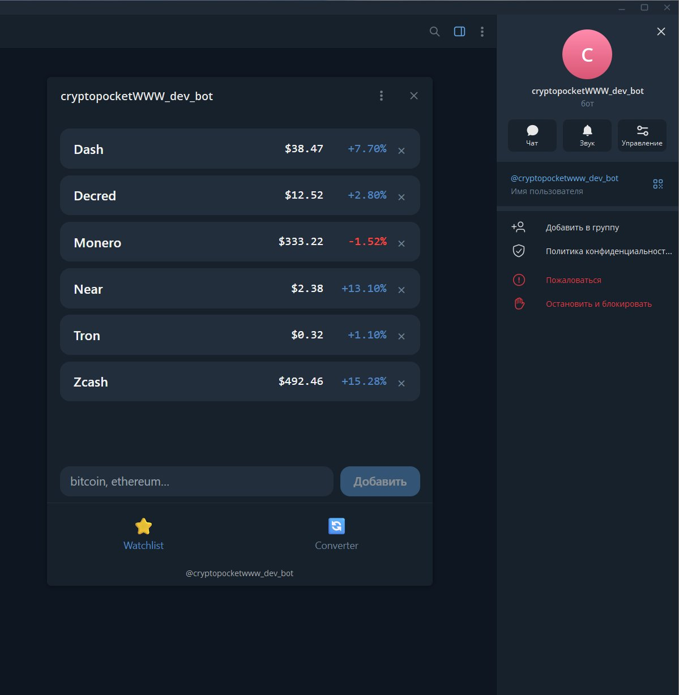
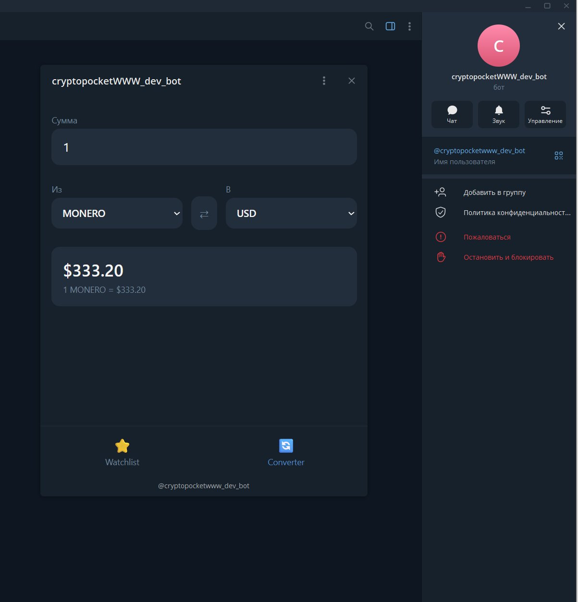

# CryptoPocket 🪙

Telegram Mini App для отслеживания крипто-цен и конвертации валют.
Открывается прямо внутри Telegram, работает в продакшене.

**Живое демо:** [@cryptopocketwww_dev_bot](https://t.me/cryptopocketwww_dev_bot) — открой бота и нажми кнопку меню **CryptoPocket**

---

## Возможности

- 📋 **Watchlist** — добавляй монеты, смотри живые цены и изменение за 24ч
- 🔄 **Конвертер** — переводи между криптой и фиатом (USD/EUR/RUB) по актуальным курсам
- 🔐 Авторизация через Telegram `initData` с валидацией подписи на сервере
- 💾 Персональный список монет сохраняется на бэкенде (SQLite)

---

## Скриншоты

### Watchlist — живые цены и изменение за 24ч


### Конвертер — крипта ↔ фиат


Монеты в конвертере подтягиваются из персонального watchlist пользователя.
Кнопка ⇄ меняет направление конвертации, курс пересчитывается автоматически.

---

## Стек

| Слой       | Технологии                                        |
|------------|---------------------------------------------------|
| Frontend   | React 18, Vite, Telegram WebApp SDK, Tailwind CSS |
| Backend    | Python, FastAPI, aiogram, SQLite                  |
| Данные     | CoinGecko API (с кэшем и retry-логикой)           |
| Деплой     | Ubuntu VPS, nginx, systemd, Let's Encrypt (HTTPS) |

---

## Архитектура

```
Telegram ──> Mini App (React)
                 │  initData (подписанные данные пользователя)
                 ▼
            nginx (HTTPS, Let's Encrypt)
                 │
                 ├──> статика фронтенда (dist/)
                 │
                 └──> /api → FastAPI (systemd-сервис)
                              │  валидация initData (HMAC-SHA256)
                              ├──> SQLite (watchlist пользователя)
                              └──> CoinGecko (цены, кэш 60с, retry)
```

**Ключевые решения:**
- `initData` валидируется на бэкенде по алгоритму Telegram (HMAC-SHA256 с токеном бота) — фронту не доверяем
- Запросы к CoinGecko идут только с сервера, с кэшем на 60 секунд и повторами при rate-limit (429/502)
- Бэкенд работает как systemd-сервис с автоперезапуском
- HTTPS обязателен для Telegram Mini App — настроен Let's Encrypt с автопродлением

---

## Запуск локально

### Backend
```bash
cd backend
python -m venv .venv
source .venv/bin/activate
pip install -r requirements.txt
cp .env.example .env
uvicorn app.main:app --reload
```

### Frontend
```bash
cd frontend
npm install
npm run dev
```

---

## Структура проекта

```
cryptopocket/
├── frontend/              # React + Vite + Telegram WebApp SDK
│   └── src/
│       ├── components/    # WatchlistPage, ConverterPage, TabBar
│       └── lib/           # telegram sdk init, api client
├── backend/               # FastAPI + aiogram
│   └── app/
│       ├── main.py        # роуты API
│       ├── bot.py         # aiogram bot, /start с WebApp-кнопкой
│       ├── auth.py        # валидация initData (HMAC-SHA256)
│       ├── prices.py      # клиент CoinGecko (кэш + retry)
│       └── db.py          # SQLite (watchlist)
└── docs/                  # скриншоты
```

---

## Лицензия

MIT
